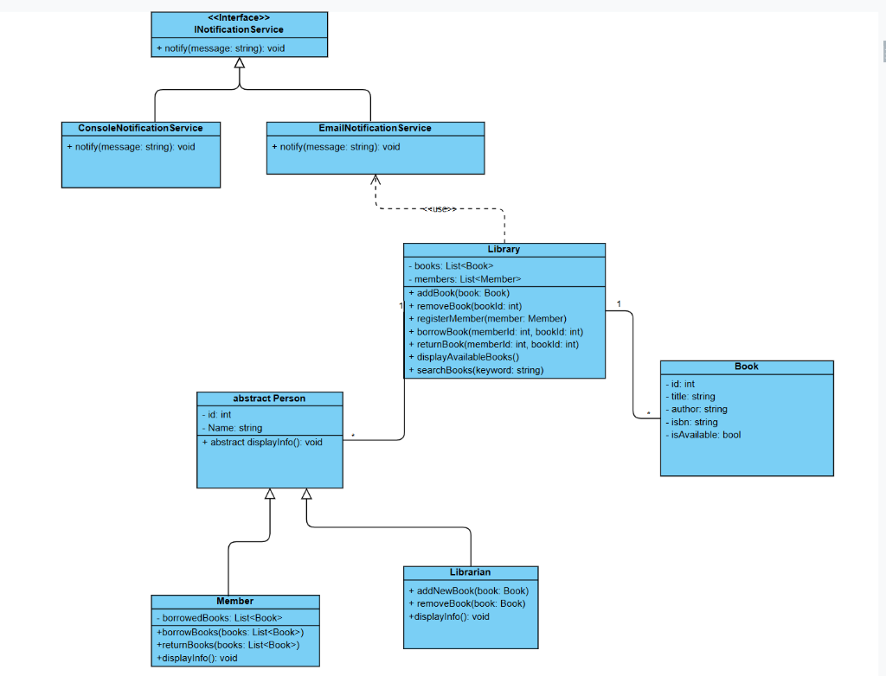

# Library Management System

A professional, object-oriented console-based Library Management System (LMS) built with C# and .NET 10.0. The application enables library administrators (librarians) and members to manage book inventories, search for books, register members, and perform borrow/return actions.

---

## Table of Contents
1. [Project Overview](#project-overview)
2. [Directory Structure](#directory-structure)
3. [UML Class Diagram](#uml-class-diagram)
4. [How to Run the Project](#how-to-run-the-project)
5. [Design Decisions](#design-decisions)
6. [Bonus Features & Implementation Details](#bonus-features--implementation-details)
    - [LINQ for Searching and Filtering](#1-linq-for-searching-and-filtering-implemented)
    - [Dependency Injection](#2-dependency-injection-implemented)
    - [Logging / Notifications](#3-logging--notifications-partially-implemented)
    - [Unit Tests](#4-unit-tests-not-implemented)
    - [Generic Repository Pattern](#5-generic-repository-pattern-not-implemented)
    - [Save Data to JSON](#6-save-data-to-json-not-implemented)
    - [Load Data from JSON](#7-load-data-from-json-not-implemented)

---

## Project Overview

The Library Management System provides a Command Line Interface (CLI) application for executing common library transactions. 

### Key Features
* **Book Management**: Register new books with automated duplicate prevention via ISBN validation.
* **Member Registration**: Track library members using an auto-incrementing ID system.
* **Borrowing & Returning**: Borrow and return books with real-time availability updates and notifications.
* **Search Functionality**: Dynamic, case-insensitive keyword searching of titles using LINQ.

---

## Directory Structure

```text
LibraryManagmentSystem/
│
└── LibraryManagmentSystem/
    ├── Models/
    │   ├── Person.cs         # Abstract base class representing any individual (ID, Name)
    │   ├── Member.cs         # Represents library members with borrowed book lists
    │   ├── Librarian.cs      # Represents administrators capable of adding books
    │   └── Book.cs           # Core Book entity (ID, Title, Author, ISBN, Availability)
    │
    ├── Services/
    │   ├── INotificationService.cs        # Logging and notification interface
    │   ├── ConsoleNotificationService.cs # Concrete service outputting to console
    │   ├── EmailNotificationService.cs   # Concrete service simulating email logging
    │   └── Library.cs                     # Core engine containing business logic
    │
    ├── Program.cs            # CLI entry point and menu router
    ├── LibraryManagmentSystem.csproj
    ├── uml_class_diagram.png # UML class diagram of the system
    ├── .gitignore            # Git ignore configuration
    └── README.md             # Project documentation
```

---

## UML Class Diagram

Below is the UML class diagram showing the core classes, interfaces, inheritance hierarchy, and relationships:



---

## How to Run the Project

### Prerequisites
* [.NET 10.0 SDK](https://dotnet.microsoft.com/download) installed on your system.

### Build and Run Steps
1. Navigate to the project's source directory:
   ```bash
   cd LibraryManagmentSystem/LibraryManagmentSystem
   ```
2. Build the project:
   ```bash
   dotnet build
   ```
3. Run the application:
   ```bash
   dotnet run
   ```

### Usage
Upon launching, the interactive CLI menu displays:
```text
==========================
Library Management System
==========================
1. Add Book
2. Register Member
3. Borrow Book
4. Return Book
5. List Available Books
6. Search Books
7. Exit
Select option:
```
Follow the console prompts to add books, register members, and execute borrowing/returning.

---

## Design Decisions

* **Inheritance & Abstraction**: Code duplication is minimized by using an abstract base class `Person` for common fields (`Id`, `Name`) and abstract method signatures (`displayInfo()`), which are inherited by `Member` and `Librarian`.
* **Polymorphism**: The `INotificationService` interface decouples user notifications from the domain models. The system can switch between Console notifications and simulated Email notifications without changing the consumer code.
* **Data Integrity**:
  * ISBN uniqueness is enforced at the `Library` service level during book addition.
  * Availability state (`IsAvailable`) transitions atomically when books are checked out or returned.

---

## Bonus Features & Implementation Details

Below is the status of the requested bonus features with references to their code implementations:

### 1. LINQ for Searching and Filtering (Implemented)
LINQ is leveraged in [Library.cs](file:///c:/vsProjects/LibraryManagmentSystem/LibraryManagmentSystem/Services/Library.cs) for efficient query execution instead of manual loops:
* **Item Retrieval**: Uses `FirstOrDefault` to retrieve items by identifier.
  ```csharp
  Book book = books.FirstOrDefault(book => book.Id == bookId);
  ```
* **Case-Insensitive Searching**: Uses `Where` and `StringComparison.OrdinalIgnoreCase` to search titles by partial keyword match.
  ```csharp
  return books.Where(book => book.Title.Contains(keyword, StringComparison.OrdinalIgnoreCase)).ToList();
  ```

### 2. Dependency Injection (Implemented)
Constructor-based dependency injection is used to supply notifications to the core system in [Program.cs](file:///c:/vsProjects/LibraryManagmentSystem/LibraryManagmentSystem/Program.cs) and [Librarian.cs](file:///c:/vsProjects/LibraryManagmentSystem/LibraryManagmentSystem/Models/Librarian.cs):
* **Library DI**:
  ```csharp
  // Program.cs
  Library library = new Library(new ConsoleNotificationService());
  ```
* **Librarian DI**:
  ```csharp
  // Librarian.cs
  public Librarian(string name, Library library): base(name){
      this.library = library;
  }
  ```

### 3. Logging / Notifications (Partially Implemented)
Logging and notification dispatching are abstracted using [INotificationService.cs](file:///c:/vsProjects/LibraryManagmentSystem/LibraryManagmentSystem/Services/INotificationService.cs). 
* `ConsoleNotificationService` logs directly to standard output.
* `EmailNotificationService` prefixes messages with `[Email] Sending:` to simulate mail notification logging.
* This abstraction can easily be extended to log to files using a library like Serilog or NLog.

### 4. Unit Tests (Not Implemented)
Unit tests are not currently included in the codebase. 
* **Proposed Implementation**: A separate xUnit or NUnit project named `LibraryManagementSystem.Tests` could be added to test target functionalities like:
  * Duplicate ISBN registration prevention.
  * Successful member checkout logic.
  * Failure scenarios when a member attempts to borrow an unavailable book.

### 5. Generic Repository Pattern (Not Implemented)
Currently, data (like books and members) is stored directly inside the main library system class.
* **Proposed Implementation**: We can create a separate storage manager (repository) to handle all data operations. This separates the library rules from how the data is saved or retrieved, making it easier to change where the data is stored in the future.

### 6. Save Data to JSON (Not Implemented)
The app does not automatically save the library's data to a file when it closes.
* **Proposed Implementation**: We can save the list of books and members into a standard text file on the computer (like `library_data.json`) when exiting the app, so we don't lose the data when the program closes.

### 7. Load Data from JSON (Not Implemented)
The app starts with an empty library every time it runs.
* **Proposed Implementation**: When the program starts up, it can search for the saved file, read it, and reload all the saved books and members back into the application.
